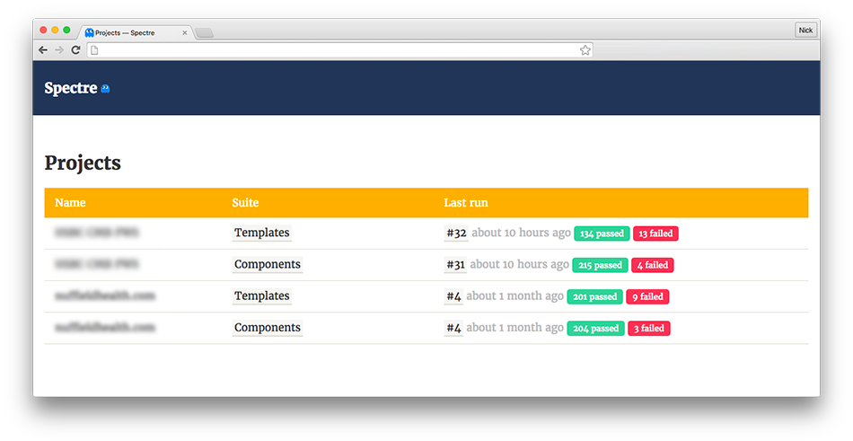
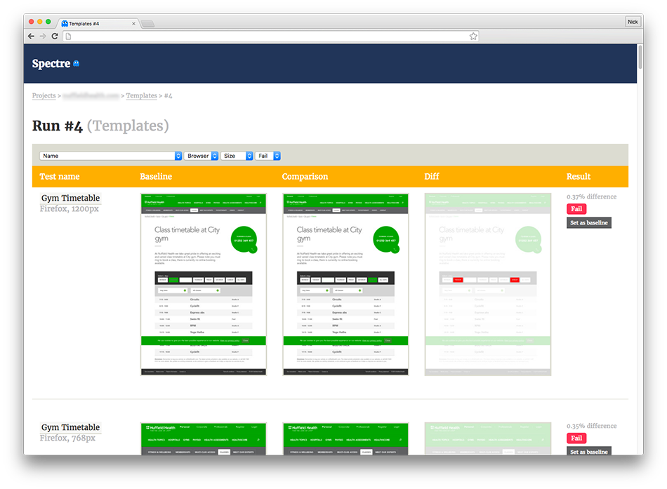

# Spectre

Spectre is a web application to diff screenshots. It's heavily influence by [VisualReview](https://github.com/xebia/VisualReview), [BackstopJS](https://github.com/garris/BackstopJS) and [Wraith](https://github.com/BBC-News/wraith). Read more about how we use it at Friday in our blog post: [How we do visual regression testing](https://medium.com/friday-people/how-we-do-visual-regression-testing-af63fa8b8eb1).

## Requirements

* Ruby
* Postgres
* Imagemagick

## Setup

* Clone the repo
* `bundle exec rake db:create && bundle exec rake db:schema:load`
* `bundle exec rails s`
* Copy `.env.example` and rename to `.env`. Change the url details if you need to.

## Submitting tests

A "test" is a screenshot and associated metadata. A test is categorised under a Project, which in turn has (test) Suites. A test is submitted and associated with a "run" of a suite.

First you should create a new "run". The JSON response will contain the `run_id` to submit with each subsequent test.

    POST /runs
      project: My Project Name
      suite: My Suite Name

Then you can submit a screenshot!

    POST /tests
      test:
        run_id: {run_id from above},
        name: Homepage,
        platform: OSX,
        browser: PhantomJS,
        width: 1024,
        screenshot: <File>

* `name` is a friendly name of your test. It should describe the template, component or state of the thing you've screenshotted
* `platform` is the OS/platform that the screenshot was taken on (e.g. OSX, Windows, iOS, Android etc.)
* `browser` is the browser that was used to render the screenshot. This will usually be a headless webkit such as Phantom, but if using Selenium you may have used a "real" browser
* `width` is the screenshot size
* `screenshot` is the image itself. PNGs are preferred

### Integration with Rake tasks or Cucumber

Most of the time you'll want to use your own rake task to control Selenium and take screenshots, or take screenshots during cucumber step definitions. There's a handy [spectre_client gem](https://github.com/wearefriday/spectre_client) to upload screenshots to your Spectre gem.

## Dummy tests

An example test run can be executed using:

    bundle exec rake screenshots

## Administration

Spectre doesn't provide a UI or API to edit or delete content. We've included `rails_admin`, so head to `/admin` for this. By default there is no password.

## Tests

[Rspec](http://rspec.info/) and [Cucumber](https://cucumber.io) are included in the project. Test coverage is minimal but please don't follow our lead, write tests for anything you add. Use `rspec && rake cucumber` to run the existing tests.
